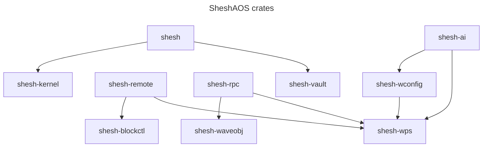

<!-- AUTO-GENERATED by tools/depgraph.py — edit by rerunning the tool,
     CI's depgraph freshness gate rejects hand edits. -->

# Shesh Ecosystem — Dependency Graph

_Generated from cargo metadata, component pyprojects, and manifests/components.toml._

## Rust workspace (SheshAOS)

### Test counts per crate (static #[test] scan)

| crate | tests |
|---|---|
| shesh-ai | 18 |
| shesh-blockctl | 49 |
| shesh-kernel | 402 |
| shesh-remote | 16 |
| shesh-rpc | 29 |
| shesh-vault | 54 |
| shesh-waveobj | 205 |
| shesh-wconfig | 31 |
| shesh-wps | 72 |
| shesh-cli | 0 |
| **total** | **876** |

## Python components (shesh-* internal deps)

```mermaid
---
title: Component internal dependencies
---
graph TD
    shesh_acp["shesh-acp"]
    shesh_audit["shesh-audit"]
    shesh_backup["shesh-backup"]
    shesh_brain["shesh-brain"]
    shesh_calendar["shesh-calendar"]
    shesh_containers["shesh-containers"]
    shesh_ebpf["shesh-ebpf"]
    shesh_files["shesh-files"]
    shesh_harness["shesh-harness"]
    shesh_mcp_bundle["shesh-mcp-bundle"]
    shesh_media["shesh-media"]
    shesh_memory["shesh-memory"]
    shesh_messaging["shesh-messaging"]
    shesh_mind["shesh-mind"]
    shesh_omniroute["shesh-omniroute"]
    shesh_orchestrator["shesh-orchestrator"]
    shesh_phone["shesh-phone"]
    shesh_secrets["shesh-secrets"]
    shesh_shell["shesh-shell"]
    shesh_skills["shesh-skills"]
    shesh_system["shesh-system"]
    shesh_backup --> shesh_audit
    shesh_brain --> shesh_audit
    shesh_calendar --> shesh_audit
    shesh_containers --> shesh_audit
    shesh_ebpf --> shesh_audit
    shesh_harness --> shesh_audit
    shesh_mcp_bundle --> shesh_audit
    shesh_media --> shesh_audit
    shesh_memory --> shesh_audit
    shesh_messaging --> shesh_audit
    shesh_messaging --> shesh_secrets
    shesh_mind --> shesh_audit
    shesh_orchestrator --> shesh_audit
    shesh_orchestrator --> shesh_mind
    shesh_shell --> shesh_audit
    shesh_skills --> shesh_audit
    shesh_system --> shesh_audit
```

## Repo level

Every arrow above lifted to its owning repo; SheshAOS crates map to the
SheshAOS repo. Cross-layer edges: shesh-brain/audit → SheshAOS via the
kernel event bridge (`kernel-events.jsonl`, ADR-0015).

