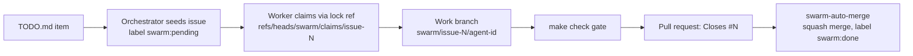

# Swarm — Parallel Sessions Coordinated Through GitHub


One agent session cannot finish the fleet's backlog, and several sessions editing the same
repository will corrupt each other's work unless something arbitrates. The swarm's answer is to
use GitHub itself as the bus: issues are the queue, a Git ref is the lock, and a pull request is
the delivery. No session ever talks to another directly.

## Summary

- Open one orchestrator plus two or three workers; they coordinate only through GitHub issues,
  Git refs, and pull requests.
- Two queue backends exist: a file queue that works offline, and a GitHub Issues queue with a
  genuinely atomic claim.
- The claim is a single lock ref per issue. The second claimant receives HTTP 422 and stops, so
  two workers cannot hold the same task.
- Every task gets its own branch and its own gate; auto-merge lands only green work.
- Workers fail closed. Without a real executor a worker idles rather than producing placeholder
  pull requests.

> **Status —** The improvements once listed as future work were implemented on 2026-08-11: the
> Issues queue, the Projects API hook, the atomic lock, pull requests through the GitHub CLI, and
> the auto-merge workflow.

## Why a bus rather than a conversation

Think of the swarm as a shared workshop with a single tool crib. Anyone may take a tool, but they
must sign it out first, and the sign-out sheet allows exactly one name per tool. Nobody negotiates
with anybody else; they all trust the sheet.

The pressure that makes this necessary is capacity. A single session snapshots at around 128 MB
and 10,000 files and slows after 60 minutes, which is how session hops became routine. Against
that, the project holds 19 components, roughly 40 documents, and 238 tests as recorded here. The
work has to be divided, and division without a lock is corruption.

Sequence of one task moving through the bus, from seeding to merge:



## Backend one: the offline file queue

The original backend is a directory tree committed to the repository, and it still works with no
network beyond `git push`.

```text
swarm/
  queue/<task-id>.json        pending {id,title,component,priority,status}
  claims/<task-id>.json       claimed {task_id, agent_id, claimed_at, branch}
  heartbeats/<agent-id>.json  agent alive
  artifacts/<task-id>.json    result done/failed
  ledger.jsonl                append-only log
```

Claiming is a race that Git settles: a worker adds its claim file, commits, and pushes. The first
push wins; the second is rejected with `fetch first` and the worker aborts. Work happens on
`swarm/<agent-id>/<task-id>`, isolated and gated before merge.

## Backend two: the GitHub Issues queue

Here the queue is a set of issues labelled `swarm`, `swarm:pending`, `component:shesh-memory`, and
a priority of `P0`, `P1`, or `P2`. `tools/swarm/github_queue.py` owns the API surface.

| Operation | Mechanism |
|---|---|
| Create | `create_issue(task)` — POST `/repos/{owner}/{repo}/issues`, checking existing titles by task ID to avoid duplicates |
| List | `list_pending_issues(component)` — GET `/issues?labels=swarm:pending&state=open`, filtered by component client-side |
| Claim | `claim_issue_atomic(issue_number, agent_id)` — see below |
| Deliver | `create_pr(branch, issue_number, title)` — POST `/pulls`, body `Closes #N` |

The claim is the interesting part, because it is the only place where atomicity actually matters.
The worker first creates a lock ref, `refs/heads/swarm/claims/issue-<N>`, by POSTing to `/git/refs`
with the current `main` SHA. GitHub returns 422 if the ref already exists, which turns ref creation
into a compare-and-swap. Testing confirmed the behavior: agent A created the lock and received
201, agent B attempted the same lock and received 422 with "already claimed".

With the lock held, the worker creates its work branch `swarm/issue-<N>/<agent-id>` from the same
`main` SHA, labels the issue `swarm:claimed`, removes `swarm:pending`, and comments with its agent
ID, branches, and timestamp. Because the lock ref is one per issue rather than one per agent, a
second claim always fails.

Work then proceeds locally: check out the branch, implement, run `make check`, and push. The pull
request can be created through the API or with
`gh pr create --title --body --base main --head <branch> --label swarm`.

## Auto-merge: the gate that lands the work

`.github/workflows/swarm-auto-merge.yml` triggers on any pull request whose head ref matches
`swarm/*`. It runs ruff, the ecosystem pytest suite, the license gate, lock resolution, and the
component gates under `src/shesh-*/tests`. When everything is green it merges with
`gh pr merge --squash --auto --delete-branch`, comments the linked issue, moves the labels from
`swarm:pending` and `swarm:claimed` to `swarm:done`, and closes the issue. When a gate fails it
comments the failure and leaves the pull request open.

> **Note —** The workflow's approval step was revised after the 2026-08-11 multi-tab incident,
> which flagged the original `gh pr review --approve` call as a forbidden self-approval; the fix
> landed on `main` the same day. See
> [the post-mortem](../../audits/incident-2026-08-11-multi-tab-swarm.md).

A Projects V2 board is optional. When `GITHUB_PROJECT_NUMBER` is set, `add_issue_to_project()`
issues the GraphQL mutation `addProjectV2ItemById`; it needs a token with the `project` scope and
a `GITHUB_PROJECT_ID` holding the project node ID, and prints a skip notice when unconfigured. If
no token is available at all, `github_queue.py` falls back to the file queue.

## Orchestrator and workers

The orchestrator, `tools/swarm/orchestrator.py`, is a command centre rather than a boss: it puts
work on the bus and watches for work that has stalled.

`--seed TODO.md` parses `⬜` and `🟡` bullets with a strict regex, derives a task ID of
`todo-<sha>`, reads the component from a backticked `shesh-*` name, and assigns `P0`, `P1`, or
`P2`. With a token present and `SWARM_USE_GITHUB=1` — the default — it creates GitHub issues
through `create_issue()` with duplicate checking; otherwise it writes `swarm/queue/*.json`.
`--dashboard` prints pending work, claims, heartbeats, artifacts, and recent ledger lines.
`--monitor` loops every 60 seconds: `git pull --rebase`, heartbeat, dashboard, requeue claims
that have gone 10 minutes without a heartbeat, then push.

Two workers exist. `tools/swarm/worker.py` is the file-queue original: `try_claim()` via
`git push`, a `do_work()` placeholder that would call the autopilot runner, then the gate and
`complete_task()`. `tools/swarm/worker_github.py` is the safe Issues implementation, and its
defensive behavior is the reason to prefer it.

| Behavior | Detail |
|---|---|
| Requires an executor | `--executor module:function` or `SHESH_WORKER_EXECUTOR`; without one the worker polls idle and never claims |
| Selection order | Pending issues in `P0`, `P1`, `P2` order, skipping `swarm:blocked` labels and blocked prose |
| Claim and work | Atomic lock ref, checkout of the work branch, callback, `make check`, refusal to create empty commits |
| Push and deliver | Pushes through `git_askpass.py`; creates a pull request only after a successful push |
| Failure handling | Failed, no-op, gate-failed, or push-failed work releases the claim and restores `swarm:pending`; a pushed branch survives a failed PR creation |
| Credentials | `github_auth.py` supplies temporary `GIT_ASKPASS` and `GH_TOKEN` values, never touching URLs or Git config |
| Tooling detection | `gh` is discovered with `shutil.which("gh")` |

You open one orchestrator and two or three workers. A worker without an executor is intentionally
idle; a real executor is either an agent callback or a separately reviewed automation worker.

## What the implementation now covers

| Question | Earlier | Now |
|---|---|---|
| Issues and Projects API instead of files? | Future work | Done — Issues API with `swarm`, `swarm:pending`, `component:X`, and priority labels; atomic lock ref; optional Projects V2 via GraphQL |
| Auto-merge artifact pull requests after the gate? | Future work | Done — `swarm-auto-merge.yml` runs ruff, pytest, license, locks, and component tests, then squash-merges, comments, and labels `swarm:done` |
| A branch and pull request per task via the CLI? | Future work | Done — `worker_github.py` prefers `gh pr create`, falls back to the API; branch `swarm/issue-N/agent-id`; body `Closes #N` |
| Can work be overwritten? | Branch per task plus atomic file push | Branch per task plus atomic lock ref; a second claim receives 422, and a merge conflict forces a rebase |
| Is maintenance needed? | Tabs opened manually | Unchanged — sessions cannot self-spawn, but workers auto-poll and stale claims are requeued |
| Is the orchestrator a command centre? | File bus | Issues as the bus with a file fallback; `swarm/` still holds the ledger and artifacts |

The verdict is that the design is fully actionable for two to four parallel sessions with
component partitioning. It was exercised against the real API: issues #1 and #2 were created,
claim A succeeded, claim B failed with "already claimed (lock exists)", branches were deleted, and
issues were closed.

## Starting a swarm

Prepare credentials once. The encrypted token persists between sessions and the plain copy is
deleted on handoff, so a new session prompts for the password.

```bash
python tools/secure_pat.py --prompt      # enter the encryption password when asked
python tools/github_auth.py --check      # prints a redacted value, e.g. gith**** len 93
git config --global user.name "Gagan Jain"
git config --global user.email "gagan.jain.se@gmail.com"
```

Open the orchestrator first, in its own session:

```bash
cd /home/user && git pull origin main
python tools/session_guard.py --status   # NEED_PASSWORD prompts through the interface
python tools/github_auth.py --check
make check
SWARM_USE_GITHUB=1 python tools/swarm/orchestrator.py --seed TODO.md --dashboard
python tools/swarm/orchestrator.py --monitor
```

Then open the workers, one component each:

```bash
python tools/swarm/worker_github.py --component shesh-memory --github --poll 45
python tools/swarm/worker_github.py --component shesh-system --github --poll 45
python tools/swarm/worker.py --component shesh-memory        # offline file queue
```

Read `docs/SESSION_HANDOFF.md` first in every session, then this chapter.

## Hopping a session mid-swarm

Hopping and claiming coexist because a claim is completed or released before the session ends,
never left dangling.

1. The worker runs `session_guard.py --tick` before each task; if a hop is due it finishes the
   current task, pushes its branch and pull request, and exits.
2. `session_guard.py --handoff` writes `NEXT_SESSION_PROMPT.md`, deletes the plain token, and keeps
   the encrypted one.
3. The next session detects `enc_exists=True`, `plain_exists=False`, `need_password=True`, asks for
   the password through the interface, decrypts to mode 600, and continues from the queue.
4. A replacement orchestrator picks up the ledger and requeues anything stale beyond 10 minutes.

There is no central server anywhere in this flow. See [Session Protocol](../session-protocol.md).

## The files involved

| File | Role |
|---|---|
| `tools/secure_pat.py` | Encrypt and decrypt the token with a password; `--store`, `--prompt`, `--check`, `--handoff` |
| `tools/github_auth.py` | Secure loader — env, then mode-600 file, then encrypted plus password, then the CLI; refuses world-readable files |
| `tools/session_guard.py` | Hop detection and handoff generation |
| `tools/swarm/common.py` | File-queue fallback: agent IDs, task listing, claim via push, heartbeat, completion |
| `tools/swarm/github_queue.py` | Issues queue: create, list, atomic claim, comment, pull request, close, Projects hook |
| `tools/swarm/orchestrator.py` | Seeding, dashboard, stale-claim monitoring, heartbeat |
| `tools/swarm/worker.py` / `worker_github.py` | File-queue worker and Issues worker |
| `.github/workflows/swarm-auto-merge.yml` | Gate and merge `swarm/*` pull requests |
| `swarm/` | Queue, claims, heartbeats, artifacts, `ledger.jsonl` |

## Security properties

The token is never committed: `.gitignore` excludes `.config/shesh/` and `.config/gh/`. The plain
and encrypted files are mode 600 inside a mode-700 directory. Encryption is PBKDF2HMAC-SHA256 at
200,000 iterations with a random 16-byte salt, wrapped in Fernet, so the password is required to
decrypt. On handoff the plain copy is deleted and the encrypted one kept.

`github_auth.py` redacts values, refuses world-readable files, and never logs the token. Swarm
files record only agent IDs, never credentials. Artifact provenance comes from
`scripts/sign_artifacts.py` with SHA-256 and SLSA attestations, and optional keyless signing with
sigstore cosign. See the [security policy](../../policies/security-policy.md) and
[secure_pat.py](../secure-pat.md).

## Optional next steps

Three extensions remain open rather than planned: driving a GitHub Projects board with custom
component, priority, and status fields — the GraphQL call is already stubbed behind
`GITHUB_PROJECT_NUMBER` and `GITHUB_PROJECT_ID`; giving the swarm a dedicated `shesh-swarm`
repository as a pure bus, currently avoided by reusing `shesh-ecosystem`; and auto-scaling workers
onto self-hosted Actions runners instead of manual sessions.

## Workspace layout after the multi-tab incident

Running five agent sessions and GitHub Actions against one bus for a day produced six durable
lessons. They are recorded here because each one is now enforced in code; the full chronology is
in [the post-mortem](../../audits/incident-2026-08-11-multi-tab-swarm.md).

1. **Daemons never share your checkout.** Start them with
   `tools/swarm/daemon.sh start [component]`, which maintains an isolated clone at
   `$SHESH_STATE/swarm-tree` with its own `.git`, so heartbeat and seed commits cannot land on your
   feature branch. `daemon.sh status|logs|stop` report process IDs, heartbeat freshness, and real
   log files.
2. **Long-running tools are line-buffered.** `sys.stdout.reconfigure` makes piped and `nohup` logs
   appear in real time, while heartbeat files remain the ground truth for liveness.
3. **`--status` and `--tick` are read-only.** Only an explicit `--handoff` regenerates the prompt
   and deletes the plain token; a hop advisory used to remove it from under running daemons.
4. **Sandbox snapshots wipe `.git/config` and site-packages.** After any restore, run
   `bash scripts/bootstrap_workspace.sh`, which is idempotent: pip toolchain, Git identity,
   token-based credential helper, optional decryption via `GITHUB_PAT_PASSWORD`, and the gate.
5. **The continuous loop lives on GitHub, not in browser tabs.** `swarm-scheduled.yml` hourly,
   `swarm-llm-worker.yml` every two hours, and `swarm-auto-merge.yml` kept working with no tabs
   open. Chat sessions are turn-based: use them for curation, deep fixes, and review, and leave
   plumbing to the daemons.
6. **Workers fail closed without an executor.** No executor means the claim returns to
   `swarm:pending`, which ended the era of placeholder pull requests closing real tasks.
