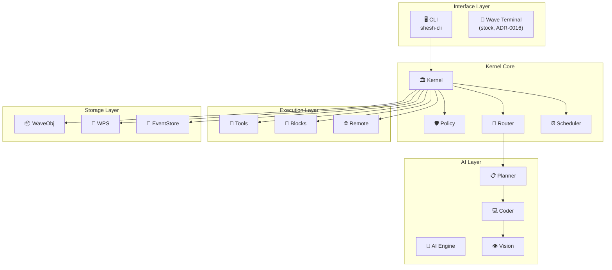
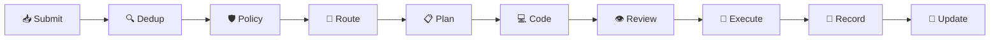
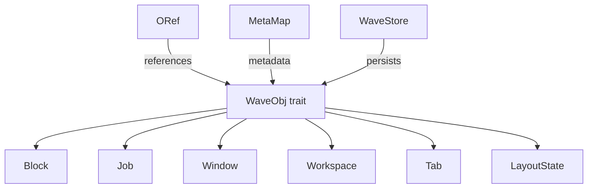
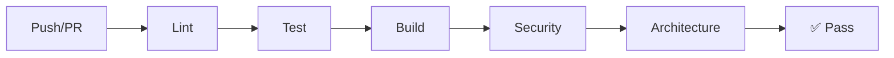

# Work on SheshAOS

** Date**: 2026-08-12 (updated for the ADR-0018 excision)
** Audience**: New contributors, maintainers, AI assistants
** Version**: v2.0.0
** Status**: Production Ready

---

## Executive summary
SheshAOS is a **production-ready, governance-first AI operating environment** built with Rust. It combines:

-  **AI task orchestration** with local LLM integration
-  **Stock Wave Terminal** as the mission-control surface (ADR-0016)
-  **Governance engine** with policy enforcement
-  **Native SSH** multiplexing
-  **Event-sourced architecture** with append-only audit trail

**Current Status**: 9 workspace crates + `shesh` CLI compile, test (872 passing), and lint cleanly. CI/CD fully configured.

---

## System architecture
### High-Level overview


### Data flow


---

## Crate inventory
| Crate | Path | Description | Tests |
|-------|------|-------------|-------|
|  `shesh-kernel` | `crates/shesh-kernel/` | Governance microkernel | 401 |
|  `shesh-waveobj` | `crates/shesh-waveobj/` | Object store & ORef graph | 204 |
|  `shesh-wps` | `crates/shesh-wps/` | Pub/Sub event broker | 71 |
|  `shesh-blockctl` | `crates/shesh-blockctl/` | PTY shell controller | 48 |
|  `shesh-ai` | `crates/shesh-ai/` | AI providers & streaming | 18 |
|  `shesh-rpc` | `crates/shesh-rpc/` | Unix socket JSON-RPC | 29 |
|  `shesh-remote` | `crates/shesh-remote/` | SSH remote shell | 16 |
|  `shesh-vault` | `crates/shesh-vault/` | Command snippets | 54 |
|  `shesh-wconfig` | `crates/shesh-wconfig/` | Config watcher | 31 |
|  `shesh` (CLI) | `bin/shesh-cli/` | Headless CLI entrypoint | 0 |

Removed 2026-08-12 (ADR-0018): `shesh-tui`, `shesh-gui`, `shesh-terminal`,
the top-level `zig/` tree, and the dead `tests/` harness — see CHANGELOG.

---

## Quick start for new developers
### Prerequisites
- Rust 1.75+ (edition 2024)
- Linux (CachyOS/Arch primary; any Linux with a Rust toolchain)
- 16 GB RAM minimum
- NVIDIA GPU optional (local model inference)

### Setup
```bash
# 1. Clone
git clone https://github.com/gaganjainse/SheshAOS.git
cd SheshAOS

# 2. Build
cargo build --workspace

# 3. Test
cargo test --workspace

# 4. Lint
cargo clippy --all-targets -- -D warnings

# 5. Format
cargo fmt
```

### First task
Start with `crates/shesh-kernel/src/runtime/kernel.rs` — the heart of the system.

---

## Architecture deep dive
### Kernel runtime

```mermaid
graph LR
    A["Kernel::submit_task"] --> B["Dedup Check"]
    B --> C["PolicyEngine::evaluate"]
    C --> D["TaskRouter::route"]
    D --> E["ProviderRegistry::get"]
    E --> F["ModelProvider::complete"]
    F --> G["ToolBroker::execute"]
    G --> H["EventStore::append"]
    H --> I["TaskProjection::update"]
```


**Key Files**:
- `crates/shesh-kernel/src/runtime/kernel.rs` — Main kernel loop
- `crates/shesh-kernel/src/policy.rs` — Policy engine
- `crates/shesh-kernel/src/router.rs` — Task routing
- `crates/shesh-kernel/src/storage/event_store.rs` — Event persistence

### Wave object model


**Key Files**:
- `crates/shesh-waveobj/src/types.rs` — Type definitions
- `crates/shesh-waveobj/src/store.rs` — SQLite persistence
- `crates/shesh-waveobj/src/oref.rs` — Object references
- `crates/shesh-waveobj/src/meta.rs` — Metadata

### Block shell control
The GUI/TUI/Zig rendering pipeline was removed in the 2026-08-12 excision
(ADR-0018): rendering belongs to Wave Terminal. What remains here is the
controller layer Wave blocks and the RPC server use:

**Key Files**:
- `crates/shesh-blockctl/src/` — PTY block controller (portable-pty)
- `crates/shesh-remote/src/` — SSH remote shell (russh)
- `crates/shesh-rpc/src/` — Unix-socket JSON-RPC surface

---

## Development environment
### VS code setup
1. Install extensions:
   - **rust-analyzer** — Rust language server
   - **CodeLLDB** — Debugger
   - **Mermaid Chart** — Architecture diagrams
   - **GitLens** — Git integration
   - **Error Lens** — Inline errors

2. Workspace settings in `.vscode/settings.json`:
   ```json
   {
     "rust-analyzer.cargo.features": "all",
     "rust-analyzer.checkOnSave.command": "clippy",
     "mermaid.autoRender": true
   }
   ```

### Recommended workflow
```bash
# Morning routine
make check    # Verify compilation
make test     # Run tests
make lint     # Check style

# During development
cargo test -p shesh-kernel            # Test specific crate
cargo clippy -p shesh-waveobj         # Lint specific crate

# Before PR
make all       # Full verification
```

---

## Quality metrics
### Current status
| Metric | Value | Target |
|--------|-------|--------|
| Tests | 872 |  grows with features |
| Test Coverage | 100% public API |  100% |
| Clippy Warnings | 0 |  0 |
| Compilation Errors | 0 |  0 |
| Orphaned Files | 0 |  0 |
| Benchmarks | 3 (real, see benches/) |  ≥3 |

### CI/CD pipeline


| Pipeline | Trigger | Checks |
|----------|---------|--------|
| CI | Push/PR | Lint, test, build, security |
| PR | Pull request | Title, size, conflicts |
| Bench | Push/PR | Criterion benchmarks |

---

## Security considerations
### Critical points
1. **Tool Execution**: All tools go through `PolicyEngine`
2. **SSH Keys**: Currently accepts all keys — configure before production
3. **AI API Keys**: Stored in config — use proper file permissions
4. **Event Store**: Append-only — ensure filesystem permissions

### Before production
- [ ] Configure SSH host key validation
- [ ] Rotate all API keys
- [ ] Enable GPG-signed commits
- [ ] Set up branch protection
- [ ] Configure secrets management
- [ ] Run full security audit

---

## Documentation index
| Document | Purpose | Audience |
|----------|---------|----------|
| [README.md](../explanation/sheshaos.md) | Project overview | Everyone |
| [CONTRIBUTING.md](https://github.com/gaganjainse/SheshAOS/blob/main/CONTRIBUTING.md) | Contribution guide | Contributors |
| [SECURITY.md](https://github.com/gaganjainse/SheshAOS/blob/main/SECURITY.md) | Security policy | Security researchers |
| [CODE_OF_CONDUCT.md](https://github.com/gaganjainse/SheshAOS/blob/main/CODE_OF_CONDUCT.md) | Community standards | Everyone |
| [CHANGELOG.md](https://github.com/gaganjainse/SheshAOS/blob/main/CHANGELOG.md) | Version history | Users |
| [docs/architecture.md](../explanation/sheshaos-architecture.md) | System diagrams | Developers |

---

## Immediate next steps
### Priority 1: production readiness
1. **SSH hardening** — Configure host key validation
2. **Secret management** — Move API keys to environment
3. **Branch protection** — Enable on GitHub
4. **Release process** — Tag and publish

### Priority 2: feature completion
1. **Zero-allocation ANSI parsing** — Already implemented via vte
2. **Span-batched rendering** — Implement in `view.rs`
3. **PTY backpressure** — Implement in `pty.rs`
4. **GUI refinement** — Polish Iced interface

### Priority 3: scale
1. **Performance profiling** — Identify bottlenecks
2. **Memory optimization** — Reduce allocations
3. **Concurrency tuning** — Optimize async runtime
4. **Benchmark automation** — Track performance over time

---

## Getting help
-  **Documentation**: Check this file and linked docs
-  **Issues**: [GitHub Issues](https://github.com/gaganjainse/SheshAOS/issues)
-  **Discussions**: [GitHub Discussions](https://github.com/gaganjainse/SheshAOS/discussions)
-  **Email**: gagan.jain.se@gmail.com

---

## Recognition
Contributors are recognized in:
- GitHub contributors graph
- CHANGELOG.md for significant contributions
- Annual maintainer report

---

<p align="center">
  <b> SheshAOS — Built for the future of AI-native computing</b>
</p>

<p align="center">
  <a href="https://github.com/gaganjainse/SheshAOS"> Star on GitHub</a> •
  <a href="https://github.com/gaganjainse/SheshAOS/fork"> Fork</a> •
  <a href="https://github.com/gaganjainse/SheshAOS/issues"> Report Bug</a>
</p>
