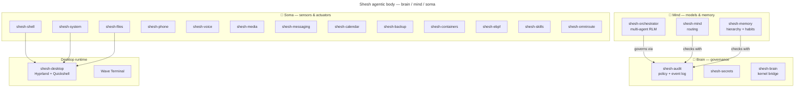
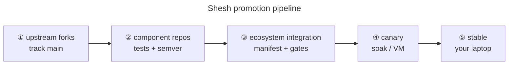

# 🐍 Shesh Ecosystem

> **The federated, local-first AI body for CachyOS/Hyprland.** An agent is a body — a
> **Mind** (models/planning/memory), a **Brain** (SheshAOS governance kernel), and a
> **Soma** (sensors & actuators on the desktop). This repo is the **orchestrator**:
> it pins forks, resolves components through quality gates, and promotes them
> `devel → canary → stable`, like a miniature Linux distribution.


- **License:** GPL-3.0-or-later (the body as a whole; components keep upstream-compatible licenses)
- **Owner:** Gagan Jain ([@gaganjainse](https://github.com/gaganjainse))
- **Target hardware:** MSI Sword 16 HX B14VEKG (i7-14700HX, RTX 4050 6 GB, 1920×1200@144, 16 GB DDR5)
- **Target OS:** CachyOS + Hyprland ≥0.55 (Lua) + Quickshell

---

## Why this repo exists

We fork every upstream we depend on and keep those forks rolling; we integrate the
best parts as **Shesh components** and only let tested combinations reach the daily
driver. That gives us **latest upstream** without waiting for releases, **safety**
(breakage is caught in canary, not on your machine), **coherence** (one manifest, one
lockfile, one audit log, one policy engine), and **ownership** (the integrated whole
is *Shesh*, not a pile of someone else's brands).

Conceptual foundation: [`docs/architecture/AGENTIC_BODY.md`](architecture/agentic-body.md) ·
Federation model: [`docs/architecture/REPO_TOPOLOGY.md`](architecture/repo-topology.md) ·
Language policy: [`docs/architecture/LANGUAGE_POLICY.md`](architecture/language-policy.md)

---

## Quick start

```bash
# 1. One command installs the WHOLE stack (desktop + AI body) on CachyOS:
bash <(curl -s https://raw.githubusercontent.com/gaganjainse/shesh-desktop/main/tools/bootstrap.sh)

# 2. Developer gate (offline — no hardware needed):
git clone https://github.com/gaganjainse/shesh-ecosystem.git && cd shesh-ecosystem
make check            # ruff + 63 tests + license gate + regenerate locks

# 3. Resolve a specific channel
python scripts/resolve_manifest.py --channel canary

# 4. See which upstreams moved (network)
make upstream
```

`make check` must pass before anything is promoted.

---

## The body



> **Where the code lives (post-consolidation, ADR-0019):** the 16 small organs ship
> from one repo — **`shesh-core`** (audit, secrets, brain, mind, shell, system, files,
> media, messaging, calendar, backup, containers, ebpf, skills, mcp-bundle, acp).
> Independently versioned services stay separate: `shesh-memory`,
> `shesh-orchestrator`, `shesh-harness`, `shesh-phone`, `shesh-omniroute`.

| Layer | Code home | Source lineage |
|---|---|---|
| **Brain** | `shesh-core` (audit, secrets, brain, acp) | SheshAOS governance kernel |
| **Mind** | `shesh-core` (mind) + `shesh-memory`, `shesh-orchestrator`, `shesh-harness` | rag-service + llm-eval-harness |
| **Soma** | `shesh-core` (shell/system/files/…) + `shesh-phone`, `shesh-voice`, `shesh-omniroute` | Newelle, shesh-desktop, MCP servers, ADB harness |

See `manifests/components.toml` for the full 23-organ list and
[docs/components/](https://github.com/gaganjainse/shesh-ecosystem/blob/main/docs/components) for per-component pages.

---

## Promotion flow



Every arrow is a gate in `scripts/` (CI runs them). Nothing reaches ⑤ without a
green gate and a btrfs snapshot before apply. The policy engine governs every tool
action the agent takes — see `policies/SKILLS_POLICY.md`.

---

## Repository layout

```text
shesh-ecosystem/
├── manifests/components.toml   # every Shesh organ (brain/mind/soma), versions & upstreams
├── channels/                   # stable.lock / canary.lock / devel.lock (resolved)
├── scripts/
│   ├── resolve_manifest.py     # TOML -> lockfile, validates schema + licenses
│   ├── check_licenses.py       # GPL-3 compatibility gate
│   ├── generate_mcp_config.py  # MCP client configs from the manifest
│   └── upstream_tracker.py     # checks forks vs upstream releases/issues
├── tests/                      # 63 offline gate tests
├── policies/                   # tool/skill policy (what the agent may do)
├── templates/                  # canonical boilerplate (boilerplate-as-code)
├── tools/                      # proofread, depgraph, docs_index, installers
├── docs/                       # architecture, ADRs, component mirrors, index
└── Makefile                    # make lint / test / check / upstream
```

## Testing

All tests are offline and hardware-independent; they validate manifests, the resolver,
the license gate, channel filtering, determinism, and upstream parsing.

```bash
python -m pytest tests/ -q     # 63 tests
```

Component repos carry their own tests; hardware tests (GPU/display/audio) run only in
the canary gate on real or VM hardware.

---

## Status

Ecosystem-wide CI is green: one reusable component pipeline (D1) covers all 23
components with `-W error`; silent-failure audit 0 errors; every third-party Action
is SHA-pinned with Dependabot moving the pins weekly. See [SECURITY.md](../policies/security-policy.md)
for the posture and [docs/THREAT_MODEL.md](../policies/threat-model.md) for the threat model.

## Documentation index

The full map: **[docs/INDEX.md](https://github.com/gaganjainse/shesh-ecosystem/blob/main/docs/INDEX.md)** (generated, CI-checked).

- **Start here:** [TODO.md](https://github.com/gaganjainse/shesh-ecosystem/blob/main/TODO.md) · [docs/GETTING_STARTED.md](getting-started.md) · [docs/GLOSSARY.md](../glossary.md)
- **Security:** [SECURITY.md](../policies/security-policy.md) · [docs/THREAT_MODEL.md](../policies/threat-model.md) · [docs/RECOVERY.md](../policies/recovery.md)
- **Architecture:** [Agentic Body](architecture/agentic-body.md) · [Repo topology](architecture/repo-topology.md) · [Languages](architecture/language-policy.md) · [Dependency graph](https://github.com/gaganjainse/shesh-ecosystem/blob/main/docs/architecture/DEPENDENCY_GRAPH.md)
- **Components:** [docs/components/](https://github.com/gaganjainse/shesh-ecosystem/blob/main/docs/components) — one page per component, generated cross-links
- **Style:** [README & docs style guide](https://github.com/gaganjainse/shesh-ecosystem/blob/main/docs/README_STYLE_GUIDE.md)
- **Desktop:** [shesh-desktop/docs/SHESH/](https://github.com/gaganjainse/shesh-desktop/tree/main/docs/SHESH)
- **Ops:** [ATTRIBUTION.md](https://github.com/gaganjainse/shesh-ecosystem/blob/main/ATTRIBUTION.md) (upstream credits) · [CONTAINER.md](https://github.com/gaganjainse/shesh-ecosystem/blob/main/CONTAINER.md) (dev/canary container)
- **Compiled reading:** [https://github.com/gaganjainse/shesh-docs](https://github.com/gaganjainse/shesh-docs) — the mdBook compilation of every repo's docs
