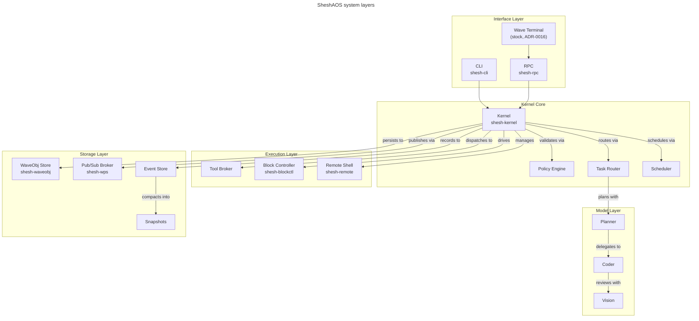
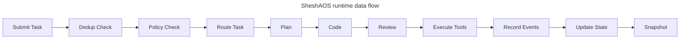
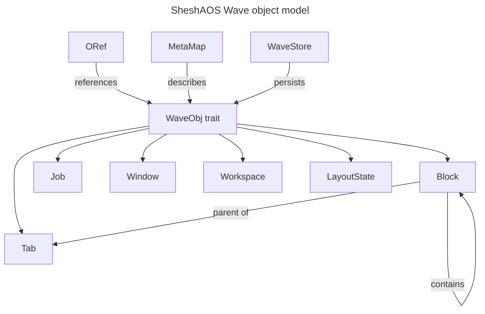
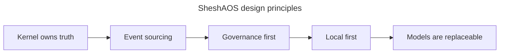

# SheshAOS

A governance-first, event-sourced AI operating system written in Rust. Models
propose actions, the kernel validates and records every state change in an
append-only audit trail, and the whole system runs local-first with replaceable
AI providers.


- **License:** GPL-3.0-or-later
- **Owner:** Gagan Jain ([@gaganjainse](https://github.com/gaganjainse))
- **Target:** CachyOS/Arch · Linux-native · Rust

[Documentation](https://github.com/gaganjainse/shesh-docs) ·
[Architecture](architecture.md) ·
[Contributing](https://github.com/gaganjainse/SheshAOS/blob/main/CONTRIBUTING.md) ·
[Security](https://github.com/gaganjainse/SheshAOS/blob/main/SECURITY.md) ·
[Changelog](https://github.com/gaganjainse/SheshAOS/blob/main/CHANGELOG.md)

## Summary

- SheshAOS is a governance-first, event-sourced AI OS: models propose, the
  kernel validates, and every change is recorded in a hash-chained log.
- It runs local-first on CachyOS/Arch + Hyprland within a 6 GB VRAM model budget.
- Nine workspace crates plus a CLI compile cleanly, with 877 tests and zero
  clippy warnings.
- The kernel owns the truth; tools execute, and models only ever propose.

## Quick start

```bash
git clone https://github.com/gaganjainse/SheshAOS.git
cd SheshAOS
cargo build --release
./target/release/shesh init
./target/release/shesh run "describe the project structure"
```

SheshAOS runs on Linux (primary target: CachyOS/Arch + Hyprland) and is
offline-capable.

## What it is

SheshAOS is a microkernel-style AI operating environment. Tasks route to
specialist local models (planner, coder, vision); a policy engine validates
every action; and an event-sourced store keeps an append-only, hash-verifiable
record of every state change. It ships with a stock Wave Terminal frontend
(ADR-0016), a full CLI, and a JSON-RPC control socket.

| Metric | Value |
| --- | --- |
| **Language** | Rust (edition 2024) |
| **Crates** | 9 workspace crates + `shesh` CLI |
| **Tests** | 877 passing |
| **Lints** | 0 clippy warnings (`-D warnings`) |
| **License** | GPL-3.0-or-later |
| **Status** | Production-ready (personal project) |

## Why SheshAOS

| Problem | SheshAOS |
| --- | --- |
| AI tools act without oversight | **Governance-first** — the kernel validates every action |
| State is mutable | **Event-sourced** — append-only, hash-chained audit log |
| Cloud-dependent | **Local-first** — works fully offline |
| Locked to one model | **Provider interface** — OpenAI-compatible + Anthropic, LiteLLM routing |
| No terminal integration | **Wave Terminal (stock)** + PTY/VT100 + SSH multiplexing |

## Architecture

The five SheshAOS layers, from the interface down to storage.



A single task, from submission to snapshot.



The WaveObj trait and the concrete types it spans.



The four principles that order the design.



## Key features

### AI engine

- Streaming responses from OpenAI-compatible and Anthropic endpoints (SSE)
- LiteLLM-compatible model routing; local-first inference, fully offline
- Multi-modal (vision) support; session history and context management

### Block and shell control

- PTY block controller (backpressure-aware reads) — the layer Wave blocks ride on
- Remote PTY shell tunneling via **russh**

### Security and governance

- Policy engine with trust tiers and capability-based security
- Approval gating for destructive operations
- Append-only event store with cryptographic integrity (hash chain plus verify)
- SSH multiplexing with connection monitoring
- Secrets vault (`shesh-vault`)

### Remote management

- Native SSH client (russh), connection health monitoring, remote PTY
- Config watcher with live reload (`shesh-wconfig`)

### Interfaces

- **Wave Terminal (stock)** — mission-control surface (ADR-0016)
- **CLI** — `shesh` init / run / doctor / status / replay
- **IPC** — JSON-RPC 2.0 over Unix sockets (`shesh-rpc`)

## Hardware target

| Component | Specification |
| --- | --- |
| **CPU** | Intel Core i7-14700HX |
| **GPU** | NVIDIA RTX 4050 (6 GB VRAM) |
| **Memory** | 16 GB DDR5 |
| **OS** | Linux — CachyOS/Arch + Hyprland (primary) |
| **Storage** | NVMe SSD |

## Model stack (6 GB VRAM budget)

| Role | Model | Use case |
| --- | --- | --- |
| **Planner** | local first (phi4-mini / Gemma class) | architecture, planning, review |
| **Coder** | qwen2.5-coder:3b class | implementation, debugging, tests |
| **Vision** | moondream2 class | screenshots, diagrams, documents |

## Project structure

```text
SheshAOS/
├── bin/shesh-cli/          # CLI entrypoint
├── crates/
│   ├── shesh-kernel/       # governance microkernel (policy, router, scheduler)
│   ├── shesh-waveobj/      # object store & ORef graph
│   ├── shesh-wps/          # pub/sub event broker
│   ├── shesh-blockctl/     # PTY shell controller
│   ├── shesh-ai/           # OpenAI/Anthropic streaming + LiteLLM routing
│   ├── shesh-remote/       # SSH remote shell (russh)
│   ├── shesh-rpc/          # Unix-socket JSON-RPC
│   ├── shesh-vault/        # command snippets & inspector
│   └── shesh-wconfig/       # config watcher & settings
├── bootstrap/              # workspace-excluded host-provisioning crate
├── configs/                # example configuration files
├── scripts/                # dev/test helper scripts
├── docs/                   # architecture (event model in crates/shesh-kernel/src/events.rs)
├── fuzz/                   # libfuzzer targets (config parse, event JSON)
├── Cargo.toml              # workspace definition
└── Makefile                # build shortcuts
```

## Development

```bash
cargo build                  # build
cargo test --workspace       # 877 tests
cargo clippy --all-targets -- -D warnings   # zero-warning gate
cargo fmt --check            # formatting
cargo bench --workspace      # 6 criterion benches
```

## Documentation

| Document | Purpose |
| --- | --- |
| [Architecture](architecture.md) | System diagrams and data flows |
| [Compiled docs](https://github.com/gaganjainse/shesh-docs) | Fleet-wide reading compilation (mdBook) |
| [Handover](handover.md) | Developer transition guide |
| [Contributing](https://github.com/gaganjainse/SheshAOS/blob/main/CONTRIBUTING.md) | Development workflow |
| [Security](https://github.com/gaganjainse/SheshAOS/blob/main/SECURITY.md) | Vulnerability reporting |
| [Changelog](https://github.com/gaganjainse/SheshAOS/blob/main/CHANGELOG.md) | Version history |
| [Code of Conduct](https://github.com/gaganjainse/SheshAOS/blob/main/CODE_OF_CONDUCT.md) | Community standards |

## Status

CI is green. For security, see
[SECURITY.md](https://github.com/gaganjainse/SheshAOS/blob/main/SECURITY.md). The
compiled reading edition lives at
[shesh-docs](https://github.com/gaganjainse/shesh-docs).

## License

GPL-3.0-or-later — see
[LICENSE](https://github.com/gaganjainse/SheshAOS/blob/main/LICENSE).
