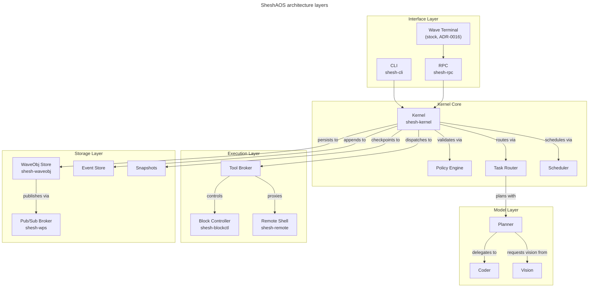
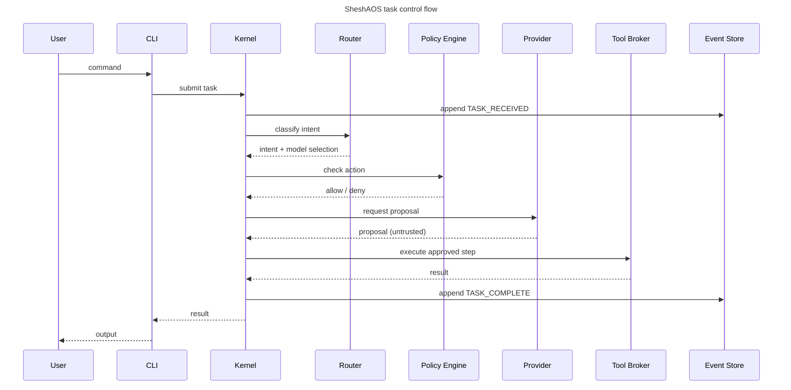

# SheshAOS — Architecture

The architecture overview lives in the project-root [README](README.md) and the
full developer brief in [handover](handover.md). This chapter focuses on the
layer model, the task control flow, the trust boundaries, and the event model
that makes the system auditable.

## Layers

The five SheshAOS layers, from the interface down to storage.



### Quick reference

1. **Kernel** — task intake, governance, scheduling, state transitions, audit
2. **Router** — intent classification, model selection
3. **Policy Engine** — deny-by-default kernel governance; the agent's MCP
   tool gate (shesh-core, ADR-0015) defaults to **confirm**, with protected
   paths hard-denied
4. **Model Providers** — swappable specialist inference (planner, coder, vision)
5. **Tool Broker** — filesystem, Git, terminal with capability checks
6. **Event Store** — append-only JSONL event log
7. **CLI** — terminal interface for all kernel operations

## Control flow

A single task, from submission through execution and recording.



```text
User → CLI → Kernel → Router (classify) → Policy (check) → Provider (infer)
                ↓                                               ↓
          Event Store ← ← ← ← ← ← ← ← ← ← ← ← ← ← ← Tool Broker (execute)
```

## Trust boundaries

- User input: **untrusted**
- Model output: **untrusted** (proposals only)
- Tool results: **partially trusted** (logged and validated)
- Event store: **trusted** (append-only, checksummed)

## Key design rules

- Models propose, never execute
- Tools execute, never decide
- Kernel validates everything
- Every state change is an event
- Every event is durable

## Event model (canonical source: code)

Events are the source of truth. Every state change, model interaction, tool
call, and policy decision is appended as an immutable JSON Lines (`.jsonl`)
record.

**The canonical `EventKind` list lives in
[`crates/shesh-kernel/src/events.rs`](https://github.com/gaganjainse/SheshAOS/blob/main/crates/shesh-kernel/src/events.rs)** —
20 kinds (TaskCreated through Error) grouped as task lifecycle, model
interactions, tool interactions, policy, and system. This chapter does not
duplicate the enum; the fuzz target `event_json` and the doc-tests pin the code
as the single source of truth.

Guarantees:

1. Append-only — events are never modified or deleted
2. Unique `EventId` (UUIDv7); duplicates rejected
3. Sequence numbers monotonically increasing
4. `fsync` after each write batch

Example record:

```json
{"id":"01912345-6789-7abc-def0-123456789abc","task_id":"01912345-0000-7abc-def0-123456789000","sequence":42,"kind":"TaskStateChanged","payload":{"StateChanged":{"from":"Received","to":"Classified"}},"metadata":{"source":"kernel","correlation_id":null},"timestamp":"2026-07-31T12:00:00Z"}
```
