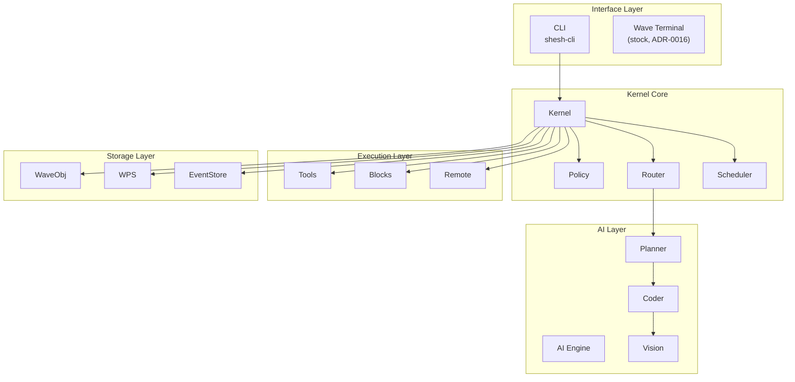
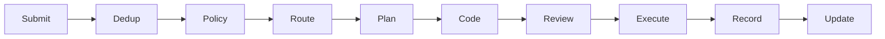
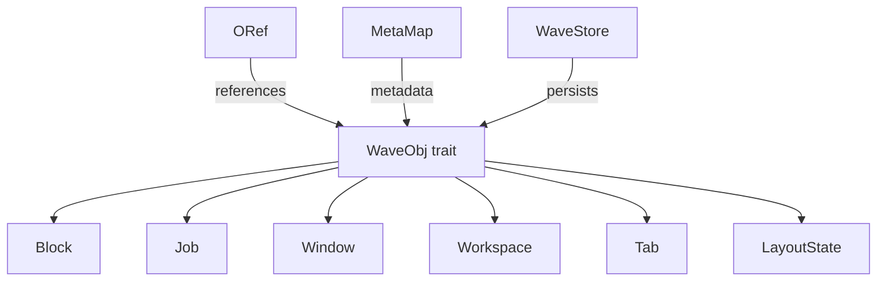
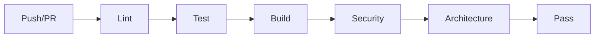

# SheshAOS — Developer handover

**Date:** 2026-08-12 (updated for the ADR-0018 excision)
**Audience:** New contributors, maintainers, AI assistants
**Version:** v2.0.0
**Status:** Production ready

This brief hands SheshAOS to a new contributor or AI assistant. It maps the
crate inventory, the development loop, the architecture's hot paths, and the
security items that must close before production.

## Summary

- SheshAOS compiles, lints clean, and tests (872 passing) across 9 workspace
  crates plus the CLI.
- The 2026-08-12 excision (ADR-0018) removed the GUI/TUI/Zig rendering pipeline;
  rendering now lives in Wave Terminal.
- The kernel is the trusted core: it validates every proposal and appends each
  state change to the event store.
- Close the SSH host-key and secrets items before any production use.

## Executive summary

SheshAOS is a production-ready, governance-first AI operating environment built
in Rust. It combines:

- AI task orchestration with local LLM integration
- Stock Wave Terminal as the mission-control surface (ADR-0016)
- A governance engine with policy enforcement
- Native SSH multiplexing
- An event-sourced architecture with an append-only audit trail

**Current status:** the 9 workspace crates plus the `shesh` CLI compile, test
(872 passing), and lint cleanly. CI/CD is fully configured.

## System architecture

### High-level overview

The five SheshAOS layers, from the interface down to storage.



### Data flow

A single task, from submission through execution and recording.



## Crate inventory

| Crate | Path | Description | Tests |
|-------|------|-------------|-------|
| `shesh-kernel` | `crates/shesh-kernel/` | Governance microkernel | 401 |
| `shesh-waveobj` | `crates/shesh-waveobj/` | Object store and ORef graph | 204 |
| `shesh-wps` | `crates/shesh-wps/` | Pub/Sub event broker | 71 |
| `shesh-blockctl` | `crates/shesh-blockctl/` | PTY shell controller | 48 |
| `shesh-ai` | `crates/shesh-ai/` | AI providers and streaming | 18 |
| `shesh-rpc` | `crates/shesh-rpc/` | Unix socket JSON-RPC | 29 |
| `shesh-remote` | `crates/shesh-remote/` | SSH remote shell | 16 |
| `shesh-vault` | `crates/shesh-vault/` | Command snippets | 54 |
| `shesh-wconfig` | `crates/shesh-wconfig/` | Config watcher | 31 |
| `shesh` (CLI) | `bin/shesh-cli/` | Headless CLI entrypoint | 0 |

Removed on 2026-08-12 (ADR-0018): `shesh-tui`, `shesh-gui`, `shesh-terminal`,
the top-level `zig/` tree, and the dead `tests/` harness — see CHANGELOG.

## Quick start for new developers

### Prerequisites

- Rust 1.75+ (edition 2024)
- Linux (CachyOS/Arch primary; any Linux with a Rust toolchain)
- 16 GB RAM minimum
- NVIDIA GPU optional (local model inference)

### Setup

```bash
# 1. Clone
git clone https://github.com/gaganjainse/SheshAOS.git
cd SheshAOS

# 2. Build
cargo build --workspace

# 3. Test
cargo test --workspace

# 4. Lint
cargo clippy --all-targets -- -D warnings

# 5. Format
cargo fmt
```

### First task

Start with `crates/shesh-kernel/src/runtime/kernel.rs` — the heart of the system.

## Architecture deep dive

### Kernel runtime

The kernel loop threads a task from submission to a recorded, projected state.

```mermaid
graph LR
    A["Kernel::submit_task"] --> B["Dedup Check"]
    B --> C["PolicyEngine::evaluate"]
    C --> D["TaskRouter::route"]
    D --> E["ProviderRegistry::get"]
    E --> F["ModelProvider::complete"]
    F --> G["ToolBroker::execute"]
    G --> H["EventStore::append"]
    H --> I["TaskProjection::update"]
```



**Key files:**

- `crates/shesh-kernel/src/runtime/kernel.rs` — main kernel loop
- `crates/shesh-kernel/src/policy.rs` — policy engine
- `crates/shesh-kernel/src/router.rs` — task routing
- `crates/shesh-kernel/src/storage/event_store.rs` — event persistence

### Wave object model

The WaveObj trait and the concrete types it spans.



**Key files:**

- `crates/shesh-waveobj/src/types.rs` — type definitions
- `crates/shesh-waveobj/src/store.rs` — SQLite persistence
- `crates/shesh-waveobj/src/oref.rs` — object references
- `crates/shesh-waveobj/src/meta.rs` — metadata

### Block and shell control

The GUI/TUI/Zig rendering pipeline was removed in the 2026-08-12 excision
(ADR-0018): rendering belongs to Wave Terminal. What remains is the controller
layer that Wave blocks and the RPC server use:

**Key files:**

- `crates/shesh-blockctl/src/` — PTY block controller (portable-pty)
- `crates/shesh-remote/src/` — SSH remote shell (russh)
- `crates/shesh-rpc/src/` — Unix-socket JSON-RPC surface

## Development environment

### VS Code setup

1. Install extensions: **rust-analyzer** (language server), **CodeLLDB**
   (debugger), **Mermaid Chart** (architecture diagrams), **GitLens** (Git
   integration), **Error Lens** (inline errors).
2. Workspace settings in `.vscode/settings.json`:

    ```json
    {
      "rust-analyzer.cargo.features": "all",
      "rust-analyzer.checkOnSave.command": "clippy",
      "mermaid.autoRender": true
    }
    ```

### Recommended workflow

```bash
# Morning routine
make check    # Verify compilation
make test     # Run tests
make lint     # Check style

# During development
cargo test -p shesh-kernel            # Test specific crate
cargo clippy -p shesh-waveobj         # Lint specific crate

# Before PR
make all       # Full verification
```

## Quality metrics

### Current status

| Metric | Value | Target |
|--------|-------|--------|
| Tests | 872 | grows with features |
| Test coverage | 100% public API | 100% |
| Clippy warnings | 0 | 0 |
| Compilation errors | 0 | 0 |
| Orphaned files | 0 | 0 |
| Benchmarks | 3 (real, see benches/) | at least 3 |

### CI/CD pipeline

A push or pull request flows through lint, test, build, security, and
architecture checks before it passes.



| Pipeline | Trigger | Checks |
|----------|---------|--------|
| CI | Push/PR | Lint, test, build, security |
| PR | Pull request | Title, size, conflicts |
| Bench | Push/PR | Criterion benchmarks |

## Security considerations

### Critical points

1. **Tool execution:** all tools go through `PolicyEngine`.
2. **SSH keys:** currently accepts all keys — configure before production.
3. **AI API keys:** stored in config — use proper file permissions.
4. **Event store:** append-only — ensure filesystem permissions.

### Before production

- [ ] Configure SSH host key validation
- [ ] Rotate all API keys
- [ ] Enable GPG-signed commits
- [ ] Set up branch protection
- [ ] Configure secrets management
- [ ] Run full security audit

## Documentation index

| Document | Purpose | Audience |
|----------|---------|----------|
| [README](README.md) | Project overview | Everyone |
| [CONTRIBUTING](https://github.com/gaganjainse/SheshAOS/blob/main/CONTRIBUTING.md) | Contribution guide | Contributors |
| [SECURITY](https://github.com/gaganjainse/SheshAOS/blob/main/SECURITY.md) | Security policy | Security researchers |
| [CODE_OF_CONDUCT](https://github.com/gaganjainse/SheshAOS/blob/main/CODE_OF_CONDUCT.md) | Community standards | Everyone |
| [CHANGELOG](https://github.com/gaganjainse/SheshAOS/blob/main/CHANGELOG.md) | Version history | Users |
| [Architecture](architecture.md) | System diagrams | Developers |

## Immediate next steps

### Priority 1: production readiness

1. **SSH hardening** — configure host key validation
2. **Secret management** — move API keys to environment
3. **Branch protection** — enable on GitHub
4. **Release process** — tag and publish

### Priority 2: feature completion

1. **Zero-allocation ANSI parsing** — already implemented via vte
2. **Span-batched rendering** — implement in `view.rs`
3. **PTY backpressure** — implement in `pty.rs`
4. **GUI refinement** — polish the Iced interface

### Priority 3: scale

1. **Performance profiling** — identify bottlenecks
2. **Memory optimization** — reduce allocations
3. **Concurrency tuning** — optimize async runtime
4. **Benchmark automation** — track performance over time

## Getting help

- **Documentation:** this file and the linked docs
- **Issues:** [GitHub Issues](https://github.com/gaganjainse/SheshAOS/issues)
- **Discussions:** [GitHub Discussions](https://github.com/gaganjainse/SheshAOS/discussions)
- **Email:** gagan.jain.se@gmail.com
